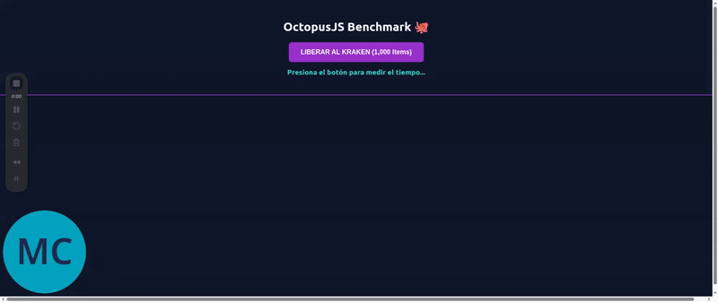

# OctopusJS 🐙 

Develop smart frontend components with the raw power of native HTML, CSS and JavaScript using this high-performance distributed intelligence framework.

<div style="display:flex; gap:10px; flex-wrap:wrap;">
    
    
    
    
    
</div>

[<h2 id="demo">Demo</h2>](#demo)

Render 1,000 reactive components in **~11ms** using only native web standards.



>Check out the [Live Demo](https://mcandeira.github.io/octopusjs/).

[<h2 id="table">Table of Contents</h2>](#table)

+ [What It Is](#what-it-is)
+ [Advantages](#advantages)
+ [Quick Start](#quick)
+ [How To Use](#use)
+ [OctopusJS Features](#features)
+ [Advanced Use Cases](#advanced)
+ [Release Notes](#release)
+ [Live Demo](https://mcandeira.github.io/octopusjs/)
+ [Benchmarks & Comparison](#benchmarks)
+ [Contact & Community](#contact)
+ [License & Acknowledgments](#footer)


[<h2 id="what-it-is">What It Is</h2>](#what-it-is)

OctopusJS is a high-performance, distributed intelligence frontend development framework designed for web developers who demand an intuitive DX (Developer Experience) alongside "science-fiction" execution speeds.

Unlike traditional frameworks, OctopusJS **does not alter** the underlying behavior of web technologies. Instead, it leverages them directly, ensuring full compatibility with all native features. This allows developers to build sophisticated components without sacrificing the freedom and raw power of native HTML, CSS, and JavaScript.

To achieve this, OctopusJS distributes its logic across **Octopus Components**. These components represent a new paradigm in web development, allowing you to manage encapsulated logic, styles, and templates using pure web standards.

[Table of Contents](#table)


[<h2 id="advantages">Advantages</h2>](#advantages)

+ **As fast as Vanilla:** It sounds impossible, but it's real. Benchmarks show OctopusJS outperforming manual DOM manipulation in complex renders by using a highly optimized, near-browser logic that minimizes reflows.

+ **Featherweight:** At only 3.8kB Gzipped, it flies on any device and keeps the memory footprint at an absolute minimum.

+ **True Encapsulation:** Build truly independent components with scoped logic and styles without the complexity of Shadow DOM if you don't need it.

+ **Raw Power:** You have direct access to the full potential of the web platform. No abstractions to limit your creativity or performance.

+ **Developer Friendly:** Incredibly easy to pick up and lightning-fast to master.

+ **Ecosystem Ready:** Fully compatible with any other frontend library or backend framework. It plays well with others.

[Table of Contents](#table)


[<h2 id="quick">🚀 Quick Start (in 60 seconds)</h2>](#quick)

Test this quick example in less than 60 seconds:

+ **Prepare your environment:** Open `VS Code` and install the `Live Preview` extension.

+ **Create the file:** Create a new `component.html` file.

+ **Paste the code:** Copy and paste the following snippet:

    ```html
    <div>
        <h1>Quick OctopusJS Example 🐙</h1>
        <input type="text" placeholder="Add your favorite movies...">
        <button>Add</button>

        <template>
            <ul>
            8{for movie in movies}
                <li>
                    <span>{{ movie.name }}</span>
                </li>
            8{endfor}
            </ul>
        </template>

        <script type="module" class="octopus">
            import { octopus } from 'https://unpkg.com/octopus-js-native/dist/octopus.min.js'

            const component = octopus.getComponent(this)
            const template = component.getChild('template')
            const input = component.getChild('input').getRef()
            const button = component.getChild('button')

            const movies = []

            button.setListener('click', () => {
                if(input.value){
                    movies.push({ name: input.value })
                    component.deleteAll('li')
                    component.render([template, {movies}])
                    input.value = ''
                }
            })
        </script>

        <style>
            @scope{
                ul{padding: 0px;}
                li{
                    background-color: darkorchid;
                    color: white;
                    list-style-type: none;
                    border-radius: 5px;
                    padding: 10px;
                    margin: 5px;
                }
            }
        </style>
    </div>
    ```

+ **Launch:** Right-click on the code or on the name of the file and select "Show Preview". That's it!

### Now What? 🛠️

+ **Experiment:** Change the HTML code to whatever you want.

+ **Program:** Change all the JS code to whatever you want. OctopusJS only adds utility functions but you can manipulate the DOM directly.

+ **Design:** Change the CSS styles to whatever you want.

### Ready for more?

To seriously use OctopusJS, continue reading.

[Table of Contents](#table)


[<h2 id="use">How To Use</h2>](#use)

[<h3 id="install">How To Install</h3>](#install)

You can integrate OctopusJS into your project using your preferred method:

#### 1\. Via NPM (Recommended for modern workflows)

Install the package using your favorite package manager:

```bash
npm install octopus-js-native
```

Then, you can import it in your JavaScript modules:

```javascript
import { octopus } from 'octopus-js-native'
```

#### 2\. Via CDN (Quick start)

For rapid prototyping or small projects, you can include OctopusJS directly from a CDN like Unpkg or JSDelivr:

```html
<script type="module">
    import { octopus } from 'https://unpkg.com/octopus-js-native/octopus.js'
</script>
```

#### 3\. Local Download

If you prefer total control, simply download the `octopus.min.js` file from the `dist` folder in our [GitHub repository](https://github.com/mcandeira/octopusjs) and include it in your project.


[<h3 id="octopus-components">How To Use Octopus Components</h3>](#octopus-components)

An Octopus Component is primarily defined by a block-level HTML element that acts as a wrapper for the component. Inside this wrapper you can place the structure, behavior and style of your component without worrying about anything outside the wrapper. Your Octopus Component always will work exactly as you designed it.

To learn how to use an Octopus Component, continue reading:

+ #### [<a id="wrapper">Create a wrapper for the Octopus Component:</a>](#wrapper)

    First, you have to use a block-level HTML element (e.g. `<div>`) that serves as a wrapper for the Octopus Component. Then you can divide it conceptually into three sections: Structure, Behavior and Style.

    ```html
    <div>
        <!-- Structure -->

        <!-- Behavior -->

        <!-- Style -->
    </div>
    ```

+ #### [<a id="structure">Make the Structure of the Octopus Component:</a>](#structure)

    In the Structure section you can use any HTML element you want. For example:

    ```html
    <div>
        <h1>Octopus Component</h1>

        <template>
            8{if active}
                <p>The {{ name }} is here.</p>
            8{endif}
        </template>

        <!-- Behavior -->

        <!-- Style -->
    </div>
    ```

    Inside each `<template>` element you can define structural fragments that are not rendered initially but can be injected dynamically using JavaScript. In this case, we use the **8-branch octopus syntax** (inspired by Twig Syntax) to inject dynamic values ("{{ val }}") and handle logic ("8{if condition} ... 8{endif}" or "8{for item in list} ... 8{endfor}").

+ #### [<a id="behavior">Code the Behavior of the Octopus Component:</a>](#behavior)

    To code the behavior of an Octopus Component you have to use an HTML `<script>` element with a `type="module"` attribute. The JavaScript logic within is entirely under your control:

    ```html
    <div>
        <h1>Octopus Component</h1>

        <template>
            8{if active}
                <p>The {{ name }} is here.</p>
            8{endif}
        </template>

        <script type="module">
            // Your JS code goes here
        </script>

        <!-- Style -->
    </div>
    ```

    For example, we could take the code inside the `<template>` element and inject it in the structure. To do this, we will import the OctopusJS framework and use the `class="octopus"` attribute as follows:

    ```html
    <div>
        <h1>Octopus Component</h1>

        <template>
            8{if active}
                <p>The {{ name }} is here.</p>
            8{endif}
        </template>

        <script type="module" class="octopus">
            import { octopus } from 'octopus-js-native'

            const component = octopus.getComponent(this)
            const template = component.getChild('template')

            const data = {
                name: 'Abyssal Octopus',
                active: true,
            }

            component.render([template, data])
        </script>

        <!-- Style -->
    </div>
    ```

    (!) **The `class="octopus"` attribute:** This helps OctopusJS identify and resolve the component's scope instantly.

    (!) **The `this` keyword:** In a `<script type="module">` the `this` keyword returns `undefined` so you can omit it. However, using the `this` keyword gives more meaning to the operation.

    (!) **Pure JavaScript:** You are not limited to OctopusJS features; you can use any native Web API or third-party library inside the script.

    (!!) **Scope Protection:** Using `type="module"` is mandatory to ensure encapsulation and avoid global variable collisions.

+ #### [<a id="style">Define the Style of the Octopus Component:</a>](#style)

    Finally, to style your component you can use an HTML `<style>` element. To ensure absolute encapsulation and avoid style leakage, we leverage the native `@scope` rule:

    ```html
    <div>
        <h1>Octopus Component</h1>

        <template>
            8{if active}
                <p>The {{ name }} is here.</p>
            8{endif}
        </template>

        <script type="module" class="octopus">
            import { octopus } from 'octopus-js-native'

            const component = octopus.getComponent(this)
            const template = component.getChild('template')

            const data = {
                name: 'Abyssal Octopus',
                active: true,
            }

            component.render([template, data])
        </script>

        <style>
            @scope{
                > h1 {
                    padding: 20px;
                    background-color: darkorchid;
                    color: white;
                }
            }
        </style>
    </div>
    ```

    (!) **Best Practice:** Use appropriate CSS combinators (like `>`) to target elements precisely within your component's scope.

**And that's it\!** You now have a fully encapsulated, high-performance Octopus Component. You can drop it anywhere in your HTML, confident that its logic, structure, and styles will remain isolated and conflict-free. **It just works, perfectly.**


[<h3 id="nested">Nested Components</h3>](#nested)

OctopusJS is built on an atomic architecture. To nest an Octopus Component inside another, you simply place it within the parent's structure. Each component remains an independent entity, managing its own scope, logic, and life cycle without interfering with its neighbors.

```html
<div>
    <h1>Octopus Components</h1>

    <div>
        <h2>I am a nested child</h2>

        <template>
            <p>Child render: Success!</p>
        </template>

        <script type="module" class="octopus">
            import { octopus } from 'octopus-js-native'

            const component = octopus.getComponent(this)
            const template = component.getChild('template')

            component.render(template)
        </script>

        <style>
            @scope{
                > h2 {
                    margin: 80px 0px 70px 0px;
                    color: darkslategray;
                    font-size: 24pt;
                }
            }
        </style>
    </div>

    <template>
        <p>Parent render: Also success!</p>
    </template>

    <script type="module" class="octopus">
        import { octopus } from 'octopus-js-native'

        const component = octopus.getComponent(this)
        const template = component.getChild('template')

        component.render(template)
    </script>

    <style>
        @scope{
            > h1 {
                padding: 20px;
                background-color: darkorchid;
                color: white;
            }
        }
    </style>
</div>
```

[Table of Contents](#table)


[<h2 id="features">OctopusJS Features</h2>](#features)

The OctopusJS library provides a robust API through the `octopus` "constant". It is designed to handle everything from DOM manipulation to complex inter-component state management.

### 1. Component Lifecycle & DOM Management
Accessed via `octopus.getComponent()`, these methods provide granular control over the component's internal universe:

* **`getRef()`**: Returns the native DOM reference of the component wrapper.
* **`getChild(selector)`**: A scoped query selector to safely access elements within the component.
* **`setListener(event, callback)`**: Simplifies event binding with automatic scope management.
* **`deleteAll(selector)`**: Efficiently removes all matching child elements from the DOM.
* **`onMount(callback)`**: Executes code as soon as the component is effectively attached to the DOM.
* **`onUnmount(callback)`**: Triggers when the component is removed from the DOM.
* **`render(input, position, relativeElement)`**: The high-performance engine that injects templates or strings at abyssal speeds.

### 2. Parent-Child Communication (Directed Flow)
Built-in methods to bridge the gap between nested components:

* **`setProp()` & `getProp()`**: Allows a parent to pass data down to its children (Top-down data flow).
* **`sendParent()` & `listenChild()`**: Enables a child to emit data or signals up to its parent (Bottom-up event flow).

### 3. The "Global Bridge" (Decoupled Communication)
These functions allow any two components to talk to each other, even if they aren't related in the DOM tree:

* **`setVal()` & `getVal()`**: A lightweight global state manager to share reactive values.
* **`setHelper()` & `getHelper()`**: Register and reuse utility functions across your entire application.
* **`setAction()` & `triggerAction()`**: A powerful command pattern to trigger specific behaviors remotely.
* **`setSecret()` & `getSecret()`**: **Unique Feature:** Secure data sharing using password-protected keys for sensitive information.

### 4. Advanced Server Integration
* **`fullActive()`**: Enables OctopusJS to orchestrate all server-side information exchange, turning your app into a high-performance, reactive SPA (Single Page Application) engine.


[Table of Contents](#table)


[<h2 id="advanced">Advanced Use Cases</h2>](#advanced)

OctopusJS doesn't impose arbitrary limits on your creativity. Its architecture is designed to scale with your component's complexity.

+ #### Advanced Structure:
    In an Octopus Component, **everything** outside of `<style>` and `<script>` tags is considered part of the Structure. This allows for seamless mixing of static content and dynamic fragments.
    
    Furthermore, `<template>` elements are fully recursive: they can contain other Octopus Components and complex logic using the **8-branch syntax**, enabling the creation of sophisticated, data-driven UI trees.

+ #### Modular Behavior and Styles:
    You are not restricted to a single script or style tag. You can fragment your component's logic and aesthetics for better maintainability:

    * **Multiple Scripts:** Place as many `<script type="module">` tags as needed. Use the `class` attribute to differentiate them (e.g., `class="octopus logic"`, `class="octopus events"`).
    * **Multiple Styles:** Use several `<style>` blocks to organize your CSS. By using `@scope` in each, you maintain perfect encapsulation while keeping your styles modular.

    This "Multi-Tag" approach allows you to separate concerns within the same component wrapper without any performance penalty.


[<h3 id="behind">What happens behind?</h3>](#behind)

Most modern frameworks rely on a **Virtual DOM**—a heavy, memory-consuming abstraction that acts as a middleman between your code and the browser. They constantly "diff" two massive trees of data to decide what to change.

**OctopusJS takes a different path.** It embraces the "Silicium Way": **Direct, Atomic, and Distributed.**

#### 1\. No Virtual DOM, No Overhead

OctopusJS doesn't waste cycles comparing virtual trees. It uses **Direct DOM Manipulation** through highly optimized native methods like `insertAdjacentElement`. When a component renders, it's not "calculating" a change; it's performing an **atomic injection** directly into the browser's render tree.

#### 2\. Distributed Intelligence

Instead of a centralized "Engine" that manages the entire application state (and slows down as the app grows), OctopusJS distributes the workload.

  * Each **OctopusComponent** is an independent, self-managed unit.
  * When a component updates, **only that component's scope is affected.**
  * The rest of the application remains untouched, ensuring that performance stays constant regardless of the application's size.

#### 3\. Memory Efficiency & Live NodeLists

OctopusJS is designed to be "garbage-collector friendly." By using **DocumentFragments** and moving nodes instead of cloning them, **dramatically reducing** memory pressure. We leverage the browser's own **Live NodeLists** to handle template iterations, which is the fastest way possible to move elements in the DOM.

#### 4\. Native Standard Alignment

By using `@scope` for CSS and `type="module"` for JS, we offload the heavy lifting of encapsulation to the browser's C++ core instead of simulating it with expensive JavaScript workarounds.

> **The Result:** A framework that doesn't fight the browser, but flows with it. That's how we achieve **~11ms (avg)** for rendering 1,000 items while others are still parsing their virtual trees.

[Table of Contents](#table)


[<h2 id="release">Release Notes</h2>](#release)

> The "Abyssal Octopus" emerges from the dark and deep abyss to surprise the world with its awesome intelligence, spectacular efficiency, and unparalleled agility in wielding the DOM. No one expected the appearance of this powerful rival, but OctopusJS has arrived to stay and challenge the status quo.
>
> The v1.0.0 "Abyssal Octopus" release is a statement of intent. Tired of false promises of "better DX" that turn into development nightmares, OctopusJS comes to offer developers a true path to the pinnacle of performance and freedom.

[Table of Contents](#table)


[<h2 id="benchmarks">Benchmarks & Comparison</h2>](#benchmarks)

[OctopusJS benchmark](https://github.com/mcandeira/octopusjs/blob/main/assets/benchmarks/benchmark_octopus.html) was tested against [Vanilla JS standard benchmark](https://github.com/mcandeira/octopusjs/blob/main/assets/benchmarks/benchmark_vanilla.html). The following results show the time (in milliseconds) required to render and mount **1,000 complex items** into the DOM.

| Framework       | Render Time (1k items) | Size (Gzipped) | DOM Strategy         |
|-----------------|------------------------|----------------|----------------------|
| **OctopusJS** | **~54.4ms (avg)** | **3.8kB** | **Atomic Injection** |
| Vanilla JS      | ~50.12ms (avg)                  | 0kB            | Manual Manipulation  |
| React 18        | ~145ms                 | ~42kB          | Virtual DOM          |
| Vue 3           | ~110ms                 | ~33kB          | Virtual DOM / Proxy  |

[Table of Contents](#table)


[<h2 id="contact">Contact & Community</h2>](#contact)

OctopusJS is a project born from the passion for a better, faster web. If you want to contribute, report a bug, or simply share your experience, feel free to reach out:

<!-- + **Website:** [octopusjs.com](https://octopusjs.com) -->
+ **GitHub:** [Report an Issue](https://github.com/mcandeira/octopusjs/issues)
+ **Email:** mcandeira.code@gmail.com

**Let's build a faster web together. 🐙**

[Table of Contents](#table)


[<h2 id="footer">License & Acknowledgments</h2>](#footer)

+ **License:** Distributed under the **MIT License**. See `LICENSE` for more information.
+ **Collaborative Engineering:** A special thanks to **Gemini (Google AI)** for its insightful role as a "Silicon Partner" in the documentation, release an improvement of this project.

[Table of Contents](#table)